# Vector Veil Challenge Walkthrough

The difficulty of this challenge mainly arises from understanding and debugging code obfuscated with AVX2. For example, recognizing the `atoi` function written in AVX2 can be difficult. Additionally, values are not stored in general-purpose registers like `rax`, but instead in SSE and AVX registers such as `xmm0` and `ymm0`. Mathematical calculations are also done with AVX2 instructions instead of conventional x64 instructions.

The following are some critical points for solving this challenge:

- (Optional) Fix the null byte at the end of the file so that the program can be recognized as a function
- (Optional) Defeat the anti-debug mechanism to enable debugging and stepping through the code
- Find the FNV-1a loop responsible for calculating the registration code
- Understand how the registration code input is parsed (`atoi`)

## Detailed Walkthrough

This walkthrough will use IDA as the analysis environment as an example. This challenge can be solved following the same principle with any other environments.

Upon opening the binary in IDA, it can be seen that IDA is unable to recognize the code as as functions. This means we cannot get a control flow graph, which is inconvenient. When we try to manually define a function and the program's entry point using `p`, IDA produces an error:

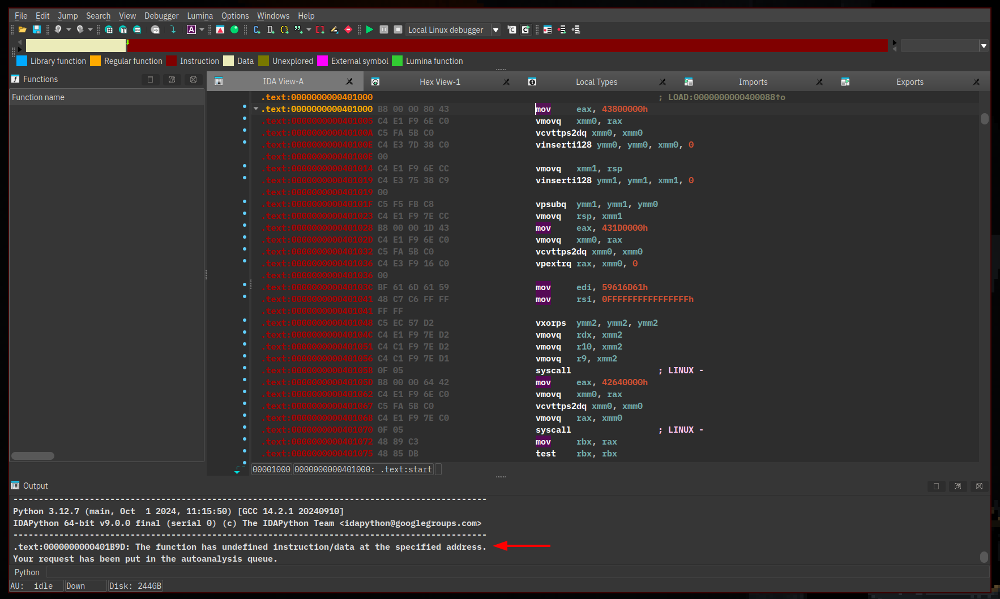

The error leads us to the end of the program. The code immedialy above `loc_401B9D` is equivalent to `exit(0);`. The bytes after that syscall is never reached and interpreted as code. The code above only refers to `0x401B9D+1`, which means the null byte at `0x401B9D` is never used.

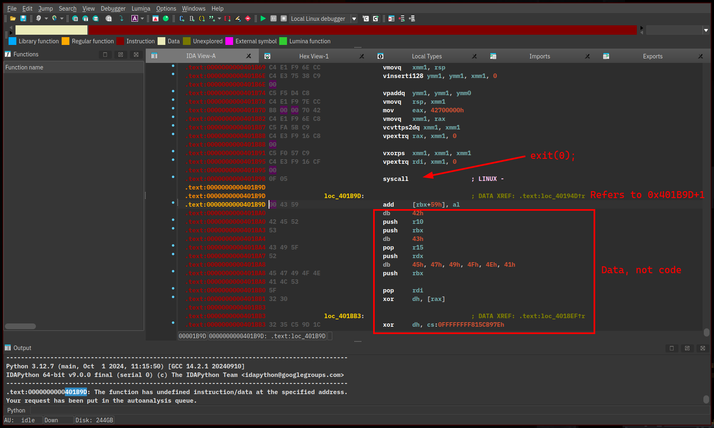

We can leverage this and change the byte to a `ret` instruction so IDA can recognize the code above as a function. This is not required, but will help make the following analysis easier.

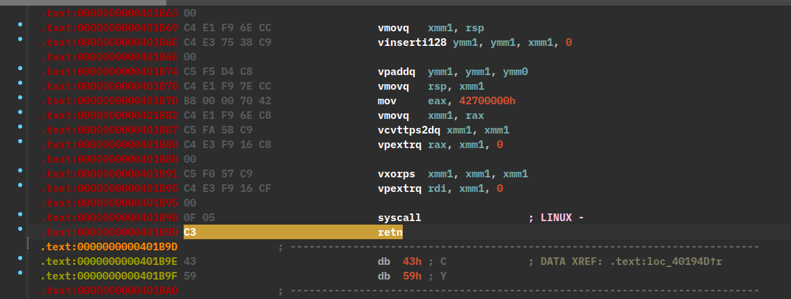

After changing the null byte to a `C3`, we can now manually define a function at the program's entrypoint.

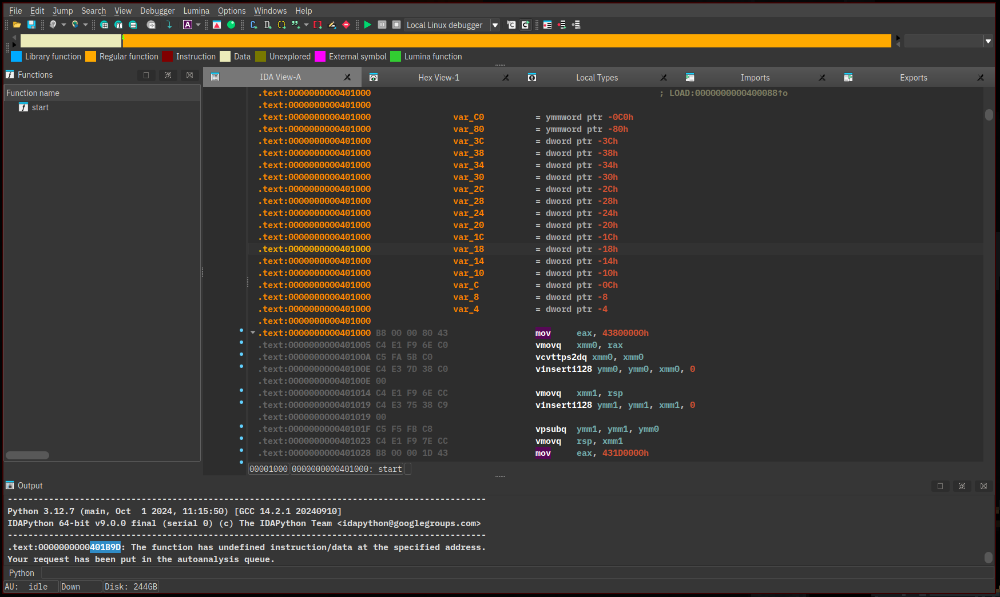

Now that IDA recognizes the code as a function, we can tell it to make a control graph.

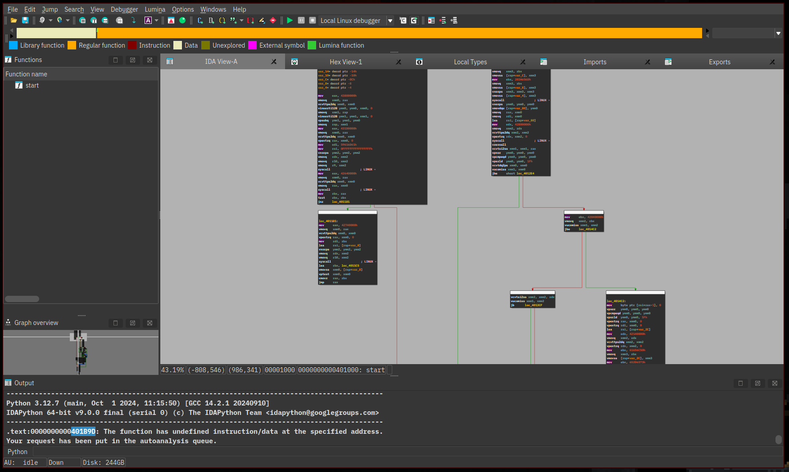

If we debug the code, it will produce a segfault. This is because this program contains an anti-debug mechanism. It forks a child process which attaches its parent with `ptrace`. If the attach fails, it means a debugger is present and will not jump to the correct code afterwards.

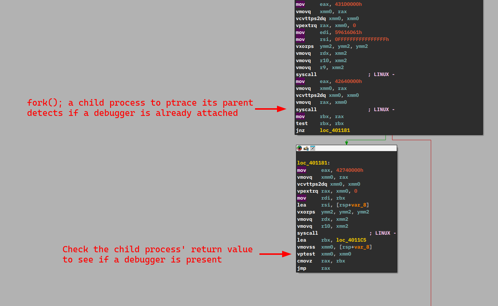

We can reverse the logic here to allow stepping through the program with a debugger.

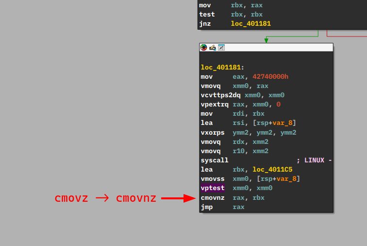

If we step through the code, at some point the program will print the line `Please enter your name:` and read the voter's name. We can follow the data read by the syscall and see that it's being processed by the instructions below. The registration code is verified by hashing the voter's name with FNV-1a hash then xor it with the bytes `CYBERSCI`.

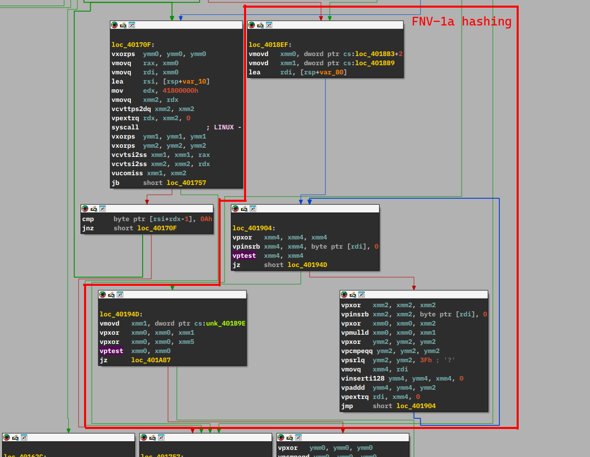

If we enter `Mateo Alvarez` as the name and a random registration code, we can catch the correct calculated hash in memory stored in the `xmm0` register here.

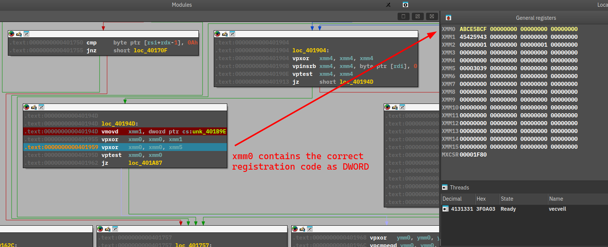

Now if we follow how the input registration code is processed, it is parsed by this code which is the `atoi` function written in AVX2. This means the registration code we need to enter is the number `0xABCE5BCF` in base 10.

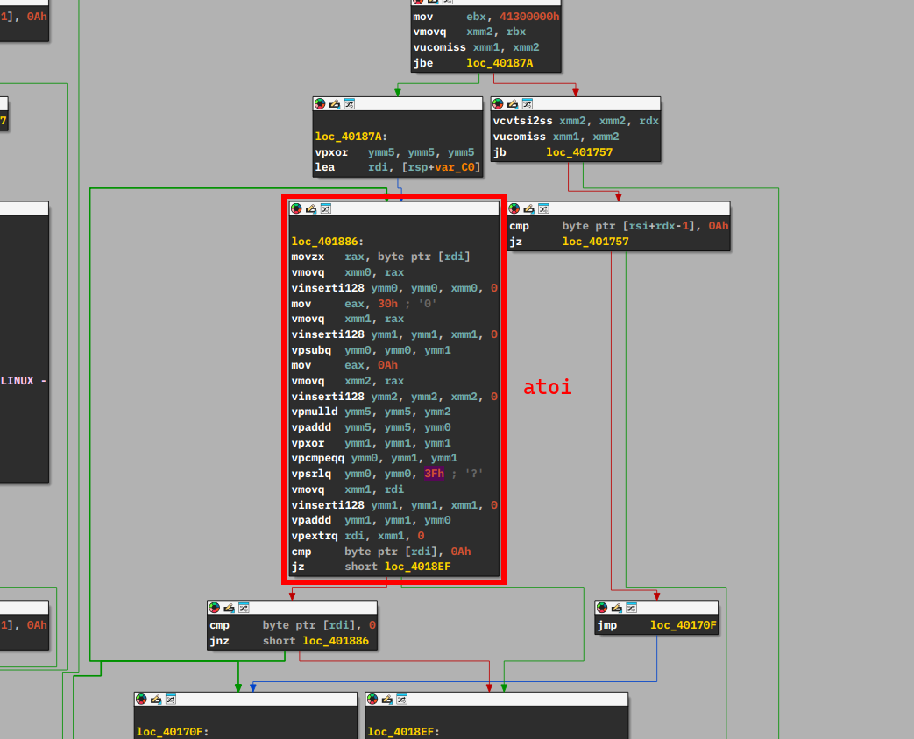

If we convert the number from hex to base 10 and enter it as the registration code, we will pass the identity validation, solving this challenge. The answer is `2882427855`.

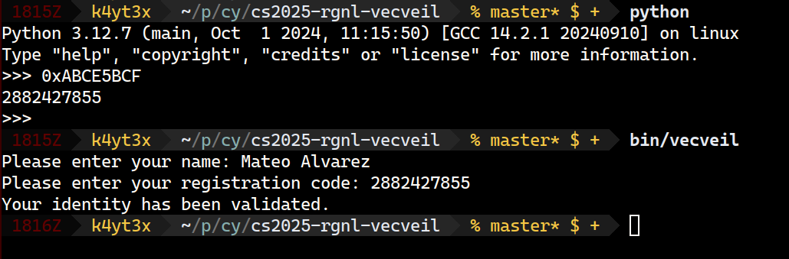